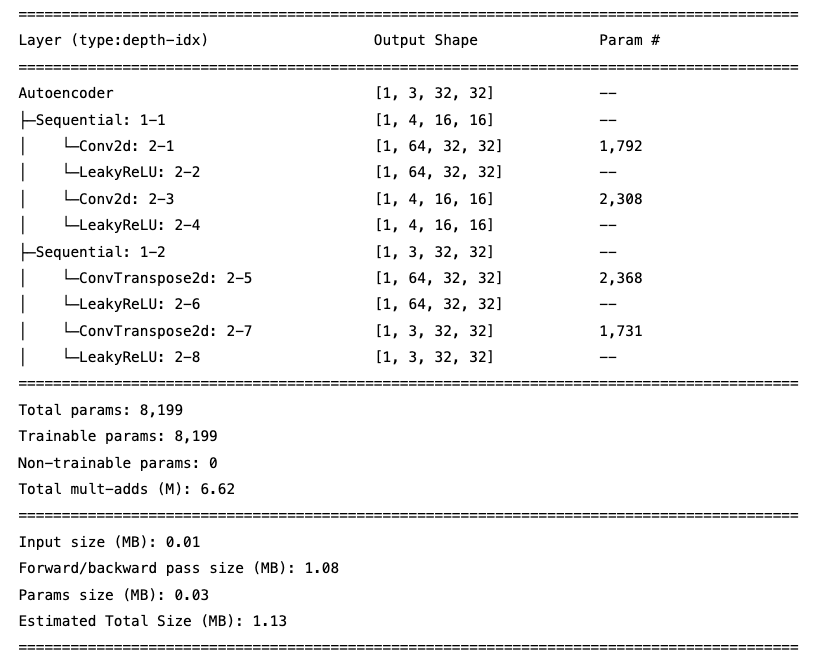
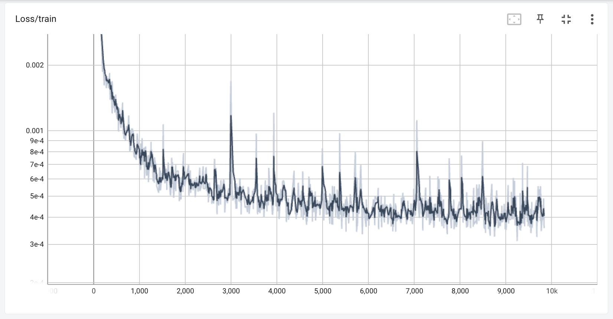
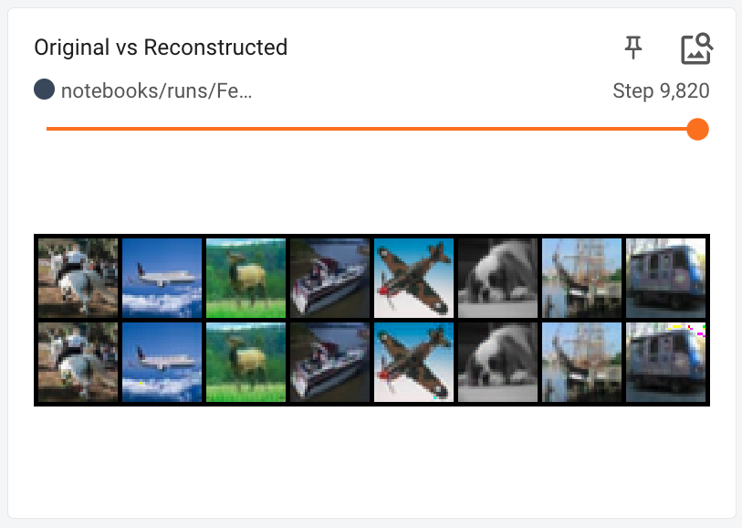
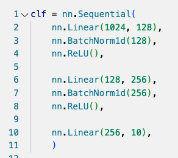
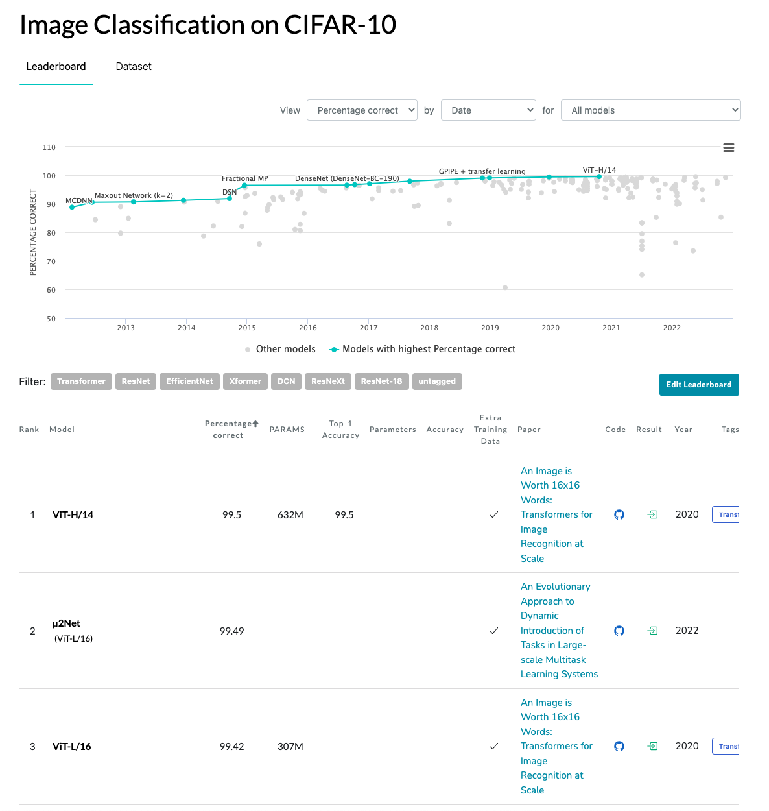
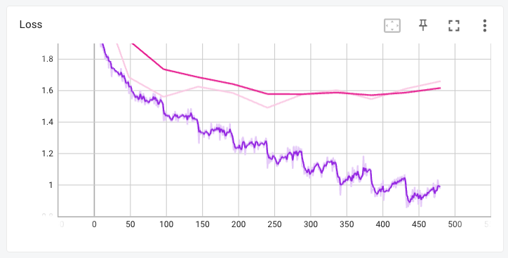
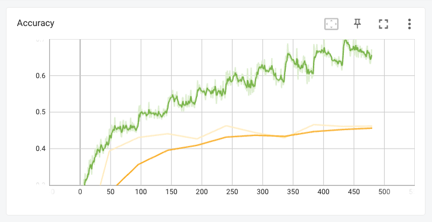
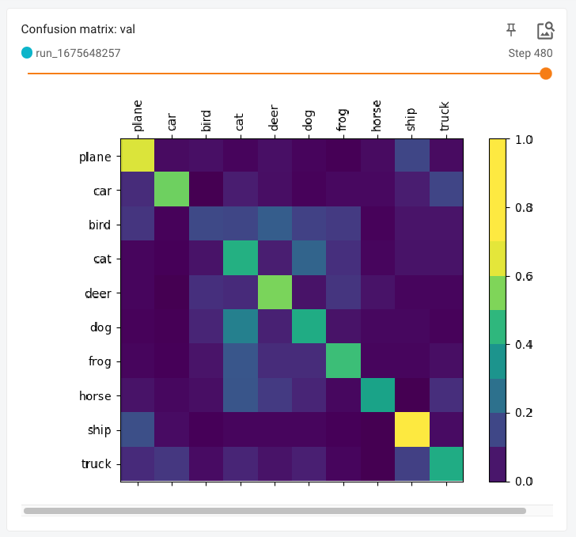

# Итоги

## Кратко

На данных CIFAR-10 обучил автоэнкодер и классификатор.

Содержание:
1. Автоэнкодер
2. Классификатор
3. Выводы
4. Технические детали


## Автоэнкодер
Для автоэнкодера выбрал простейшую архитектуру: две свертки в одну сторону и две в обратную.


  
### Выбор архитектуры
При выборе учитывал следующие моменты:
* Скрытое представление должно быть размерности ниже, чем исходное → $x < 32 * 32 * 3 = 3072$
* Скрытое представление не должно быть слишком маленьким — у нас 10 классифицируемых категорий, и внутри каждой объекты могут заметно отличаться по форме и цвету
* Свертка лучше сохраняет пространственную информацию для изображений
* Модель не должна быть слишком большой, чтобы модель показала хоть какой-то результат на моем слабеньком ноутбуке за разумное время
* Плохое качество модели обещали не оценивать :)

### Качество

Качество автоэнкодера решил оценивать по функции потерь (MSE) плюс визуальный контроль. 

В реальной задаче можно было бы посмотреть на специализированные метрики качества из области сжатия изображений. Например, structural similarity (ssim) или psnr. Но здесь это кажется лишним.

С train/val/test сплитом тоже не стал заморачиваться — ради экономии времени применю это только на этапе классификатора.

Насколько можно судить по ошибке на train и пикселированной визуализации, то сами изображения восстанавливаются неплохо. Однако на некоторых из них проявляются явно заметные цветовые артефакты. Из свертки, вероятно? Stride, наверно, надо было оставить единицей. Надо бы разобраться... а может и так сработает? Рискну :)

Batch MSE (log scale)


Пример результатов




## Классификатор

Реализовал простейшую нейронную сеть из нескольких полносвязных слоев.



### Пайплайн

Тестовый датасет разбил на три части: 

Для тестирования модели данные разбил на три части — train/val/test (48K/2K/10K изображений). Тюнинг делал на train/val, финальный замер качества делал на test.

О размерах датасетов. Размер тестового был задан из коробки, а для валидации случайным образом вынул из train 2 тысячи картинок, больше не нужно.

### Качество  классификатора

Классы в датасете сбалансированы, а это значит, что можно без проблем смотреть на долю правильных ответов (Accuracy). Дополнительно я еще посматривал на матрицу ошибок, она довольно наглядная.

Итоговые результаты моего классификатора:
1. На train — 64.4+% (остановил преждевременно)
2. На val — 46.2%
3. На test — 44.2%

А в мире, вообще-то так: https://paperswithcode.com/sota/image-classification-on-cifar-10


Лучший результат — 99.5%. Я даже не уверен, что своими глазами столько на этом датасете смогу выжать %)


## Выводы (ака следующие шаги)

Модель получилось не очень, что дальше?

На графиках видно, что сильно переобучается (train loss << val loss), причем за 10 эпох это хорошо становится видно. 






Дальше надо копать туда:
* добавить данных с помощью аугументаций

* включил бы регуляризацию

* поковырять автоэнкодер бы не помешало

* плюс можно пойти почитать, что в топовых моделях напридумывали

Ну и после этого снова возвращаться к анализу ошибок на train/val/test датасетах.


### Маленькое отступление про демонстрацию

Формат демонстрации зависит от того, кто целевая аудитория. Клиенту нужно одно, коллегам второе, журналу для публикации — третье. В целом, Tensorboard себя неплохо зарекомендовал и я бы делал его отправной точной для всего остального.

Посмотреть тензорборды (только скаляры, без изображений):
1. [Автоэнкодер](https://tensorboard.dev/experiment/2g68w3ZOSnOVrFADLro6Jw/#scalars&runSelectionState=eyJGZWIwNl8wMS0xNS0zOF9ob2x5YXJyYXkubG9jYWwiOnRydWV9)
2. [Классификатор](https://tensorboard.dev/experiment/4GDmSG9yQIKPL7jx66RVvg/#scalars&runSelectionState=eyJydW5fMTY3NTY0NjczMy9BY2N1cmFjeV90cmFpbiBhY2N1cmFjeSI6ZmFsc2UsInJ1bl8xNjc1NjQ2NzMzL0FjY3VyYWN5X3ZhbCBhY2N1cmFjeSI6ZmFsc2UsInJ1bl8xNjc1NjQ2NzMzL0xvc3NfdHJhaW4gbG9zcyI6ZmFsc2UsInJ1bl8xNjc1NjQ2NzMzL0xvc3NfdmFsIGxvc3MiOmZhbHNlLCJydW5fMTY3NTY0ODA2Ny9BY2N1cmFjeV90cmFpbiBhY2N1cmFjeSI6ZmFsc2UsInJ1bl8xNjc1NjQ4MDY3L0FjY3VyYWN5X3ZhbCBhY2N1cmFjeSI6ZmFsc2UsInJ1bl8xNjc1NjQ4MDY3L0xvc3NfdHJhaW4gbG9zcyI6ZmFsc2UsInJ1bl8xNjc1NjQ4MDY3L0xvc3NfdmFsIGxvc3MiOmZhbHNlLCJydW5fMTY3NTY0ODI1Ny9BY2N1cmFjeV90ZXN0IGFjY3VyYWN5Ijp0cnVlLCJydW5fMTY3NTY0ODI1Ny9BY2N1cmFjeV90cmFpbiBhY2N1cmFjeSI6dHJ1ZSwicnVuXzE2NzU2NDgyNTcvQWNjdXJhY3lfdmFsIGFjY3VyYWN5Ijp0cnVlLCJydW5fMTY3NTY0ODI1Ny9Mb3NzX3RyYWluIGxvc3MiOnRydWUsInJ1bl8xNjc1NjQ4MjU3L0xvc3NfdmFsIGxvc3MiOnRydWV9)


(К сожалению, гугл загрузку изображений туда не поддерживает. Я сохранил полный лог в репозиторий, на всякий случай).

## Технические детали

Модельки из тетрадок переупакованы в src.models.autoencoder.py & classifier.py. Они там сразу инициализируются и, в принципе, подготовлены для запуска в продакшен (забудем на минутку, что при текущей модели точнее будет наугад категорию называть). 

### Установка

Чтобы все точно работало, нужно установить этот репозиторий как пакет:
```
python -m venv venv
. venv/bin/activate
pip install -r requirements.txt
pip install -e .
```

Для тестов:
```
pip install pytest
```

### Структура репозитория

* data → данные для обучения

* models → веса для моделей

* notebooks → тетрадки с экспериментами

	* notebooks/runs* → сырые логи экспериментов (обычно в .gitignore, но это тестовое)

* resources → картинки для readme.md

* src → все рутины для обучения, код финализированных моделей и прочие полезные инструменты

* tests → тесты для контроля и дебага вынесенных из тетрадок модулей

* setup.py → базовый скрипт, чтобы сделать все пакеты доступными из любой папки + задел на упаковку сервис

### Рабочая среда

* Автоэнкодер писал на PyTorch
* Классификатор на PyTorch Lightning
* Для визуализации использовал TensorBoard
* Пару тестов написал на PyTest  
