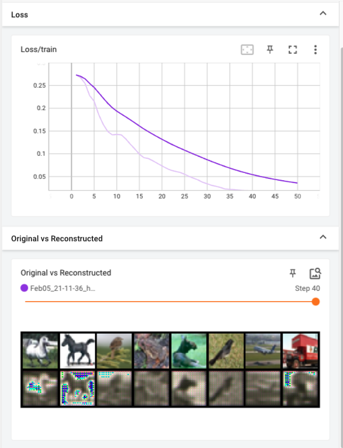
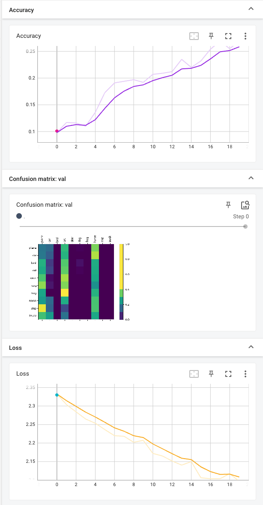

# Итоги

## Кратко

На данных CIFAR-10 обучил автоэнкодер и классификатор. 

Содержание:
1. Автоэнкодер
2. Классификатор
3. Выводы
4. Технические детали


## Автоэнкодер
Для автоэнкодера выбрал простейшую архитеутру (ССЫЛКА): две свертки в одну сторону и две в обратную:


  
### Выбор архитектуры
При выборе учитывал следующие моменты:
* Скрытое представление должно быть размерности ниже, чем исходное → $x < 32 * 32 * 3 = 3072$
* Скрытое представление не должно быть слишком маленьким — у нас 10 классифицируемых категорий и внутри каждой объекты могут заметно отличаться по форме и цвету
* Свертка лучше сохраняет пространственную информацию для изображений
* Сверка не должна быть слишком большой, чтобы модель показала хоть какой-то результат на моем слабеньком ноутбуке за разумное время
* Плохое качество модели обещали не оценивать :)

### Качество

Качество простого автоэнкодера можно вполне оценивать по функции потерь (MSE) плюс визуальный контроль. 

В реальной задаче можно было бы посмотреть на специализированные метрики качества из области сжатия изображений. Например, structural similarity (ssim) или psnr. Но здесь я это посчитал лишним.

Модель получилась отвратная. Все дело в том, что я потратил кучу времени на отладку TensorBoard и на шлифовку модели у меня времени совсем не осталось. Ну что ж — это тоже data point, как говориться.




## Классификатор

Реализовал простейшую нейронную сеть. 

### Пайплайн

Для тестирования модели данные разбил на три части — train/val/test

### Качество  классификатора

Классы в датасете сбалансированы, поэтому без проблем можно использовать долю правильных ответов (Accuracy). Дополнительно можно смотреть на матрицу ошибок, она довольно наглядная.

Текущий расклад такой: https://paperswithcode.com/sota/image-classification-on-cifar-10


Лучший результат в мире — 99.5. 
В этом тестовом задании, наверное, реально получить 90-95%.
Моя нетюнингованная модель: 47%


## Выводы (ака следующие шаги)

Итак, что же делать? В иделаьном мире без дедлайнов, я бы поэкспериментировал со следующими вещами.

#### Улучшить автоенкодер

* Попробовать другие архитектуры
	* fully-connected layers
	* batchnorm
	* maxpooling
- Нормализовать входные данные
	- (почему-то во всех туториалах cifar10 нормализуют неправильно)
- Попробовать регуляризацию

В принципе, подготовленная инфраструктура позволяет это достаточно просто сделать.

#### Улучшить классификатор
- На удачу, не вникая и не тратя много особо времени
	- Попробовать несколько fully-connected layers
	- Попробовать выдавать из автоэнкодера unflatten представление
- Посмотреть, что делают топовые модели
- Ну и начать проводить анализ ошибок на train/val/test датасете (чтобы улучшать выбраную модель)


### О демонстрации

Формат демонстрации зависит от того, кто целевая аудитория. Клиенту нужно одно, коллегам второе, журналу для публикации — третье. В целом, Tensorboard себя неплохо зарекомендовал и я бы делал его отправной точной для всего остального.


## Технические детали

### Установка
```
python -m venv venv
. venv/bin/activate
pip install -r requirements.txt
pip install -e .
```

### Структура репозитория

* data → данные для обучения

* models → веса для моделей

* notebooks → тетрадки для экспериментов

* src → все рутины для обучения, код финализированных моделей и прочие полезные инструменты

* tests → тесты для контроля и дебага вынесенных из тетрадок модулей

* setup.py → базовый скрипт, чтобы сделать все пакеты доступными из любой папки + задел на упаковку сервис

### Рабочая среда

* Автоэнкодер писал на PyTorch
* Классификатор на PyTorch Lightning
* Для визуализации использовал TensorBoard
* Пару тестов написал на PyTest  
